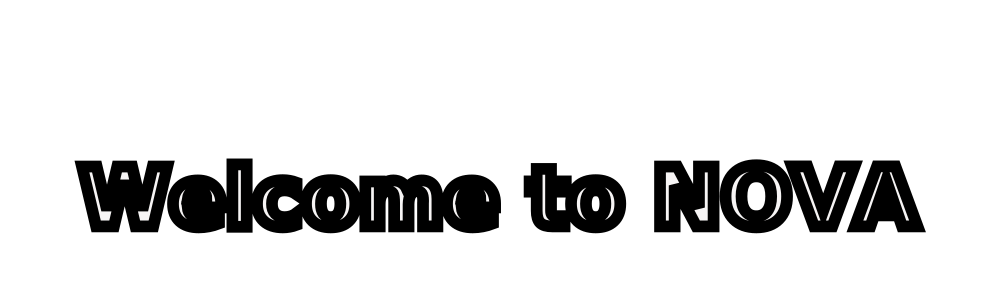
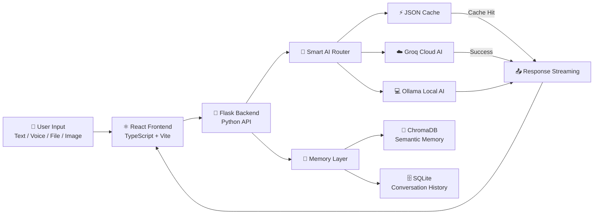

<p align="center">
  
</p>


<p align="center">
  
  
  
  
  
</p>

---

<p align="center">
  
</p>

<p align="center">
  <a href="#-what-is-nova">What is NOVA?</a> •
  <a href="#-key-features">Features</a> •
  <a href="#️-system-architecture">Architecture</a> •
  <a href="#️-tech-stack">Tech Stack</a> •
  <a href="#️-getting-started">Get Started</a> •
  <a href="#-demo">Demo</a> •
  <a href="#-team">Team</a>
</p>

<br>

## 💡 What is NOVA?

Most AI assistants make you choose: **fast or private, smart or offline, chat or control.**

**NOVA doesn't make you choose.**

It's a full-stack personal AI assistant that blends cloud intelligence with local, on-device AI — so it stays quick when you're online, and keeps working when you're not. It remembers who you are, talks back out loud, understands the files and images you hand it, and can actually reach out and control your computer, not just chat about it.

> Think of it less like a chatbot, and more like a co-pilot that lives on your desktop.

| For non-technical readers | For technical readers |
|---|---|
| Talk to NOVA like a person — it remembers your preferences, replies out loud, and can open apps, adjust your volume, or set reminders just by asking. | A React/Vite + Flask stack with a smart online/offline AI router (Groq ⇄ Ollama), semantic memory via ChromaDB, and a natural-language desktop automation layer. |

<br>

## ✅ NOVA Can

<table>
<tr>
<td width="50%" valign="top">

- 💬 Chat naturally, with live streaming replies
- 🧠 Remember information about you across sessions
- 🎙️ Speak and listen — fully hands-free
- 🖥️ Control your desktop with plain English

</td>
<td width="50%" valign="top">

- 📝 Manage notes, reminders, and alarms
- 📂 Understand files and images you upload
- 🌐 Work online (Groq) *and* offline (Ollama)
- 🛠️ Call built-in tools like weather & calculator

</td>
</tr>
</table>

<br>

## ✨ Key Features

<details open>
<summary><b>💬 Conversational AI</b></summary>
<br>

- Streaming AI responses for a natural, real-time feel
- Context-aware conversation, not just single-turn Q&A
- Groq cloud AI integration for fast, high-quality answers
- Ollama local AI fallback so it never fully breaks offline
- JSON response caching for instant repeated answers

</details>

<details>
<summary><b>🧠 Memory System</b></summary>
<br>

- Semantic memory powered by ChromaDB
- Full conversation history stored in SQLite
- Persistent, personalized user preferences
- Lightweight browser-side reminders and notes

</details>

<details>
<summary><b>🎙️ Voice Assistant</b></summary>
<br>

- Browser-based speech recognition (speech-to-text)
- Natural spoken replies (text-to-speech)
- Wake-phrase support — e.g. *"Hey Nova"*
- Clear hands-free states: idle → listening → processing → speaking

</details>

<details>
<summary><b>📂 File & Image Context</b></summary>
<br>

- Upload files for NOVA to read and explain
- Responses grounded in what you just shared
- Image-understanding pipeline (vision UI ready; backend endpoint is in active development)

</details>

<details>
<summary><b>⏰ Productivity Tools</b></summary>
<br>

- Notes management
- Reminders
- Alarm system
- Personal memory recall on demand

</details>

<details>
<summary><b>🖥️ Desktop Automation</b></summary>
<br>

Control your computer using natural language:

- 🔊 Volume control (up / down / set / mute)
- ☀️ Brightness control
- 🖱️ Mouse movement, clicks, scroll
- ⌨️ Keyboard actions and shortcuts
- 🪟 Window management (close / minimize)
- 🌍 Browser automation (open sites, search & play YouTube)
- ⏻ Shutdown / restart / cancel-shutdown commands

</details>

<details>
<summary><b>🛠️ Built-in Tools</b></summary>
<br>

A small, extendable tool ecosystem:

- ☁️ Weather
- 🧮 Calculator
- 🕐 Current time
- 🎲 Random number generator

</details>

<br>

## 🏗️ System Architecture



**How a request flows, step by step:**

1. Your input — text, voice, a file, or an image — enters through the React/Vite frontend.
2. The Flask backend hands it to the **Smart AI Router**.
3. The router checks the cache first → a hit returns an instant answer.
4. On a miss, it tries **Groq** (cloud) → falls back to **Ollama** (local) if Groq fails or you're offline.
5. Meanwhile, the **Memory Layer** pulls relevant context from ChromaDB + SQLite and folds it into the prompt.
6. The answer streams back to you in real time.

<br>

## 🧰 Tech Stack

| Layer | Technology |
|---|---|
| 🎨 **Frontend** | React 19, TypeScript, Vite, CSS |
| ⚙️ **Backend** | Python, Flask, Flask-CORS |
| 🤖 **AI** | Groq API (`llama-3.3-70b-versatile`), Ollama (`llama3.2:1b`, local) |
| 💾 **Storage** | SQLite (conversations), ChromaDB (semantic memory), JSON cache, browser localStorage |
| 🖱️ **Automation** | pyautogui, pynput, psutil, pycaw, webbrowser, subprocess |
| 🚀 **Deployment** | Vercel config with WASM / Cross-Origin isolation headers |

<br>

## ⚙️ Getting Started

### 1️⃣ Clone the repository
```bash
git clone https://github.com/anshxgaur/NOVA.git
cd NOVA
```

### 2️⃣ Set up the frontend
```bash
npm install
npm run dev
```

### 3️⃣ Set up the backend
```bash
pip install -r requirements.txt

# set your Groq API key
export GROQ_API_KEY=your_key_here      # macOS / Linux
set GROQ_API_KEY=your_key_here         # Windows CMD

python app.py
```

### 4️⃣ (Optional) Enable offline mode
```bash
ollama serve
```
Once Ollama is running locally, NOVA automatically switches to it whenever Groq is unreachable — no extra setup needed.

<br>

## 📖 Documentation

<p align="center">
  <a href="./DOCUMENTATION.md">
    
  </a>
</p>

<div align="center">

| Resource | Description |
|---|---|
| 📘 **Documentation** | Complete technical explanation |
| 🏗️ **Architecture** | System design and AI workflow |
| 🧠 **Memory System** | ChromaDB + SQLite design |
| 🤖 **AI Router** | Groq + Ollama fallback logic |
| 🖥️ **Automation** | Desktop control architecture |
| 🚀 **Setup Guide** | Installation instructions |

</div>

<br>

## 🔭 Vision & Roadmap

- [ ] Complete the vision/VLM pipeline for full image-based reasoning
- [ ] Expand automation with more cross-platform actions
- [ ] Add a dedicated request-sanitization / orchestration layer to harden tool-call execution
- [ ] **Healthcare data-intelligence extension** *(future vision)* — disease-risk prediction, patient vitals dashboard, hospital resource optimization

<details>
<summary><b>⚠️ Known Limitations</b></summary>
<br>

- Local-model quality vs. speed trade-off on limited hardware
- First-load latency while Ollama spins up
- Vision/file-context pipeline is UI-ready, but the backend endpoint isn't production-complete yet

</details>

<br>

## 🎥 Demo

<p align="center">
  <a href="https://github.com/anshxgaur/NOVA">
    
  </a>
</p>

<br>

<p align="center">
<a href="https://drive.google.com/file/d/1LQvjQurzuNe3QyqzRPicC-9EJ66fqtaJ/view?usp=drive_link">

</a>
</p>

<h2>👥 Team</h2>

<table align="center">
<tr>
<td align="center">

<a href="https://www.linkedin.com/in/ansh-gaur-46b7a4378/">
<br>
<b>Ansh Gaur</b>
</a>

</td>

<td align="center">

<a href="www.linkedin.com/in/abhinav-roy-">
<br>
<b>Abhinav Roy</b>
</a>

</td>

<td align="center">

<a href="https://www.linkedin.com/in/apoorvashukla9091/">
<br>
<b>Apoorva Shukla</b>
</a>

</td>

<td align="center">

<a href="https://www.linkedin.com/in/ankit-shukla-877705285/">
<br>
<b>Ankit Shukla</b>
</a>

</td>

</tr>
</table>

## 🏁 Conclusion

<p align="center">
  

<p align="center">
  
</p>

